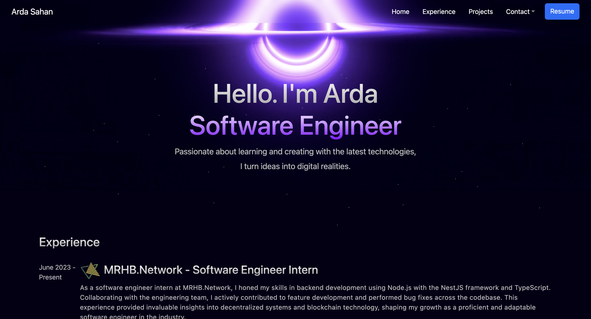

# Personal Portfolio V2
Welcome, this is my second iteration of my personal portfolio. This project is built using ReactJs, Bootstrap and Sass to showcase my skills, projects, and experience. You can visit the site here https://www.ardasahan.com.


 
## 🛠 Set up
1. Install dependencies

   ```sh
   npm install
   ```

## 🚀 How to run Project

1. Start project

   ```sh
   npm run dev
   ```

## 🎨 color codes

| Color          | Hex                                                                |
| -------------- | ------------------------------------------------------------------ |
| **Background** |  `#040015` |
| **Accent**     |  `#6ea8fe` |
| **Border**     |  `#2d2d2d` |
| **Hover**      |  `#4c4c4c` |
| **Text**       |  `#bbbbbb` |
| **Card**       |  `#1c1c1c98` |
| **White**      |  `#ffffff` |
